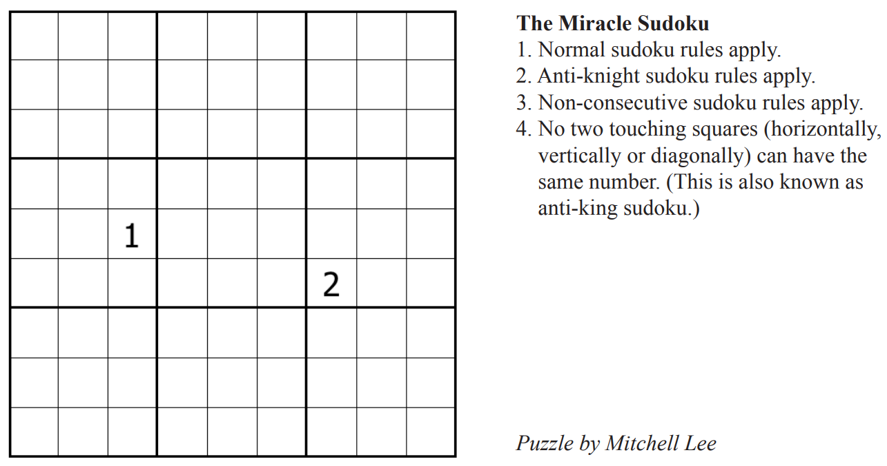

# SudokuSolver
Sudoku solver in F#. This version currently uses exceptions for control flow, which is frowned upon in the F# world. Next I'll attempt to change it to use a mondaic Result construct.

## Data Structures

```
type Cell = Known of int | Possible of Set<int>
type Grid = Cell[,]
```

## Algorithm

To attempt to solve a problem, an initial board state and a `makeMove` function are supplied. The `makeMove` function sets a value in a cell to a `Known` integer and updates all the `Possible` sets of integers for cells affected by the particular game rule.

`makeSudokuMove` is used for standard Sudoku.

## Miracle Sudoku

`makeMiracleSudoku` move is used for the [Miracle Sudoku](https://www.youtube.com/watch?v=yKf9aUIxdb4) problem by [Mitchell Lee](https://www.theguardian.com/science/2020/may/18/can-you-solve-it-sudoku-as-spectator-sport-is-unlikely-lockdown-hit).
 

